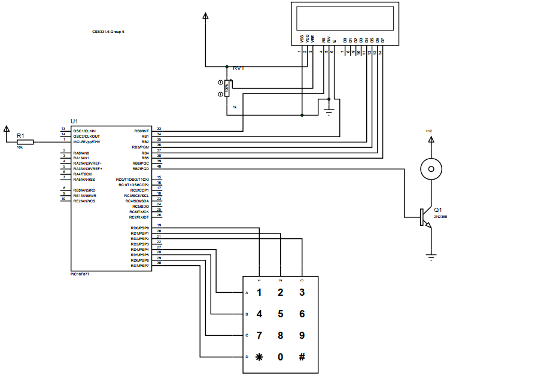

# Password-based-door-lock-system-using-PIC-microcontroller

  PIC 16F877 microcontroller,  Keypad-Phone,  Alphanumeric lcd display, and a dc motor is being used for this project. There is a pre-saved password in the microcontroller.
  User will enter the correct password to rotate the motor
  
  
